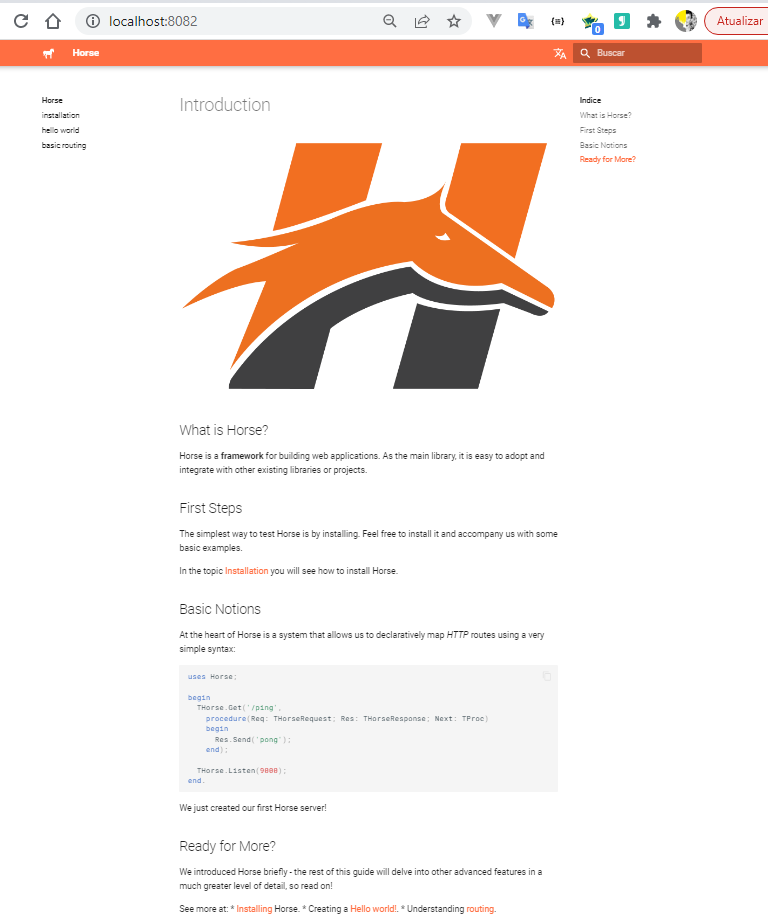

# horse-mkdocs
Setup to document Horse based on mkdocs (Python)

Check out the **pt-br** version for readme [leiame.md](LEIAME.md)

To generate this documentation i've used the python 3.6 (ou newer)
Create an virtual environment (recommended) or just type `pip install -r requirements.txt`

## Setup

1. Using virtual environment

To use virtual env , first of all, install **virtualenv** lib by cmd `pip install virtualenv`
Then generate virtual env with following script.

```shell
#On Windows
>virtualenv venv
>"venv/Scripts/>activate.bat" 

>(venv) pip install -r requirements.txt
>(venv) cd docs/pt/ #Choose the translation you want working on
>(venv) mkdocs serve -a localhost:8082
```

!!! This setup just allow you to work with one translation per time
I didn't not solve these translation feature at all, if you have some suggestion please do it. 

It will show a tag **(venv)** on left of console, that indicates that the virtual env is activated.
Last one, i've started the documentation server in port 8082

2. Without using virtual env

In this case, that's recommended to add the python into environmental variables
The application will install all python packages into the same default folder that's python installed on

```shell
> py -m pip install -r requirements.txt
>mkdocs serve -a localhost:8082
```



## How to build

Before you contribute acess owr [Conduct Guide] 
You can help wit any thing
    Creating a translation
    Solving issues
    Creating new pages with new topics
    Includding links and references to tutoriais and articles (no comercial content allowed)
    Review the pages
    Repairing bugs or suggesting new approachs

Look at the oppened issues https://github.com/ricardodarocha/horse-mkdocs/issues
Check out the languages that was not translated yet

## Improving contributions

Create clear examples  
Format code as code [link]  
Generate images PNG or Gifs [link]  
Create diagrams with https://mermaid-js.github.io/mermaid/ [link]  
Use advanced features of mk-docs [link]  
See more. [link]  

## Let starting

Fork this project on https://github.com/ricardodarocha/horse-mkdocs
Give your contrubution and create a Pull Request for `ricardodarocha/horse-mkdocs`
